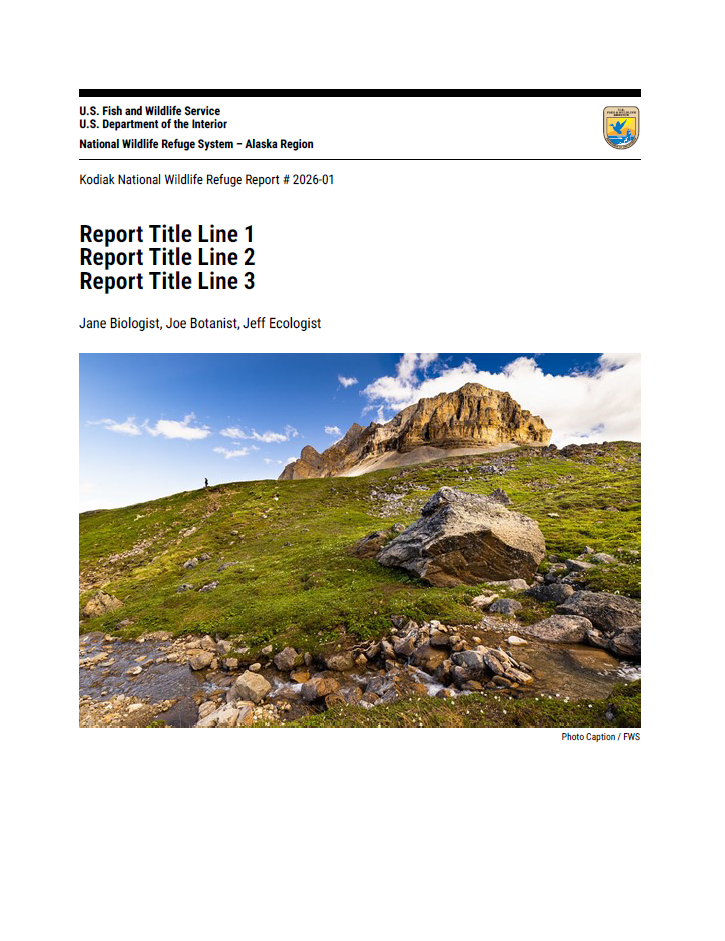

<!-- badges: start -->

<!-- For more info: https://usethis.r-lib.org/reference/badges.html -->

[](https://lifecycle.r-lib.org/articles/stages.html#experimental)

<!-- badges: end -->

# fws-report

> Unofficial template; not an official FWS publication standard.

## Overview

A Quarto **PDF format** extension that provides an unofficial U.S. Fish and Wildlife Service (FWS) report layout.

What you get:

- Cover page with banner, title, authors, cover image + credit
- “How to cite this report” page
- Running headers and Word-like heading styles
- Citeproc bibliography under # References

### Example output

Rendered PDF cover page:



## Usage

Depending on your use case, here are some [Quarto CLI](https://quarto.org/)
commands to get started.

If you would like to add the fws-report extension to an existing directory:

```bash
# In the Terminal:

quarto add USFWS/fws-report
# or
quarto install extension USFWS/fws-report
```

Alternatively, you can use a
[Quarto template](https://quarto.org/docs/extensions/starter-templates.html)
that bundles the fws-report format plus a starter .qmd document. This is a better
option if you are starting a new project from scratch, since it will automatically
create a new directory with all of the necessary scaffolding in one go. 

```bash
# In the Terminal:

quarto use template USFWS/fws-report
```

### Use the format in a .qmd

```yaml
---
title: "My Report Title"
author:
  - "First Last"
year: 2026
report-number: "01"
cover-image: "images/cover.jpg"

format:
  fws-report-pdf: default
---
```

### Citations and references

Cite sources with `[@key]`. Provide `bibliography:` (and optionally `csl:`) in YAML.

## Getting help

Contact the [project maintainer](mailto:mccrea_cobb@fws.gov) for help with this repository. If you have general questions on creating repositories in the USFWS DGEC, reach out to a USFWS DGEC [owner](https://github.com/orgs/USFWS/people?query=role%3Aowner).

## Contribute

Contact the project maintainer for information about contributing to this repository. Submit a [GitHub Issue](https://github.com/USFWS/fws-report/issues) to report a bug or request a feature or enhancement.

-----

 This work is
licensed under a [Creative Commons Zero Universal v1.0
License](https://creativecommons.org/publicdomain/zero/1.0/).